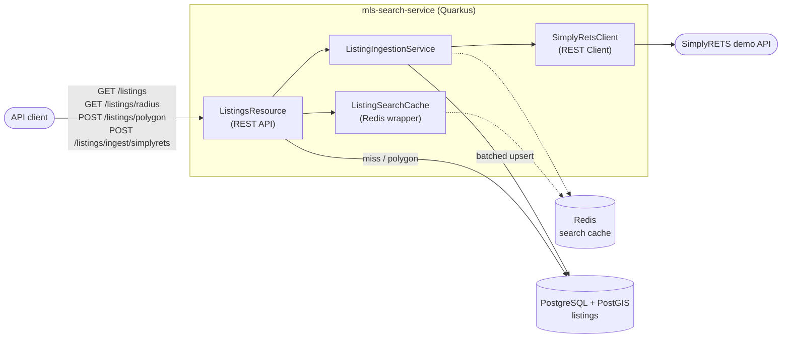

# mls-search-service

A Quarkus (Java 21) service that ingests MLS real-estate listings into a PostGIS-backed
Postgres database and exposes geospatial search endpoints (bounding box, radius, polygon)
for a map-based UI. Currently backed by the [SimplyRETS](https://simplyrets.com/) demo feed
as a stand-in for a real RESO Web API / MLS Grid integration.

Pairs with [`mls-search-app`](https://github.com/sarvika/mls-search-app), a React Native
(Expo) mobile client that renders this service's search results on a Mapbox map.

## Tech stack

| Layer | Choice |
|---|---|
| Language / runtime | Java 21, Quarkus |
| Build | Gradle (Kotlin DSL) |
| Database | PostgreSQL + PostGIS |
| Geometry type support | `net.postgis:postgis-jdbc` on top of `quarkus-jdbc-postgresql`'s driver/pool |
| Persistence access | Raw JDBC (`DataSource` + `PreparedStatement`) - no ORM |
| REST layer | Quarkus REST (Jakarta REST/JAX-RS) |
| Upstream MLS client | MicroProfile REST Client, hitting the SimplyRETS demo API |
| Cache | Redis (`quarkus-redis-client`, blocking `RedisDataSource`) |
| Schema migrations | Flyway, auto-run on startup |
| Health checks | `quarkus-smallrye-health` (`/q/health/live`, `/q/health/ready`) |

## Running locally

Local Postgres/PostGIS and Redis must be running before the app or tests can start:

```shell
docker-compose up -d
```

```shell
./gradlew quarkusDev    # dev mode, live reload, Dev UI at http://localhost:8080/q/dev/
./gradlew build         # compile, run tests, package to build/quarkus-app/quarkus-run.jar
./gradlew test          # run tests only - starts throwaway PostGIS/Redis containers via
                         # Testcontainers, so a Docker daemon must be running
```

The app serves on `http://localhost:8080` by default.

## API

- `POST /listings/ingest/simplyrets?limit=` - pulls demo listings from SimplyRETS and upserts
  them into Postgres.
- `GET /listings?west=&south=&east=&north=` - bounding-box search (map viewport pan/zoom).
- `GET /listings/radius?lat=&lng=&radiusMeters=` - radius search.
- `POST /listings/polygon` - polygon/geofence search; body is a raw GeoJSON `Polygon`
  geometry (e.g. from a map-drawing UI), not a `Feature`/`FeatureCollection`.

All search endpoints filter `is_active = true` and cap results at `LIMIT 200`. A Postman
collection is included at `postman/mls-search-service.postman_collection.json`.

## Architecture



Dashed arrows mark best-effort paths: every Redis call is caught and logged, never
propagated, so a Redis outage falls through to Postgres uncached rather than breaking a
request (see [Search result caching](#search-result-caching-redis) below).

Two packages, both under `com.sarvika.mlssearch`:

- **`mls`** - the upstream MLS data source. `SimplyRetsClient` is a MicroProfile REST Client
  interface; `SimplyRetsListing` is the raw wire-format record, deliberately kept in
  SimplyRETS's own field names (`listingId`, `geo.lat`, `mls.status`, `property.bathsFull`)
  rather than RESO Data Dictionary names, because that's genuinely what the demo API returns
  on the wire.
- **`listing`** - the domain/persistence side, which **does** use RESO Data Dictionary field
  names for its own schema and API (see `V2__align_columns_with_reso_data_dictionary.sql`
  for the full field-by-field mapping). `ListingIngestionService` pulls from
  `SimplyRetsClient` and upserts each listing into the `listings` table in a single batched
  `ON CONFLICT ... DO UPDATE`, storing the point as a PostGIS `geography(Point, 4326)`.
  `ListingsResource` exposes the search endpoints above using raw JDBC.

### Geospatial query patterns

- **Bounding box** uses the `&&` operator (GiST-index bbox pre-filter) *and* `ST_Intersects`
  (exact check) - the `&&` prefilter keeps the query index-accelerated.
- **Radius** search uses `ST_DWithin(geog, point::geography, radiusMeters)`, not
  `ST_Distance(...) < radiusMeters`, which would force a full table scan.
- **Polygon** search uses `ST_Contains(polygon, geog::geometry)` - listings are points, so
  this is point-in-polygon.

### Search result caching (Redis)

`ListingSearchCache` wraps bounding-box and radius search (polygon search is deliberately
not cached - one-off drawn shapes rarely repeat).

- Cache keys are bucketed: coordinates rounded to 3 decimal places (~110m grid) and radius
  rounded to the nearest 500m, so a small map pan/zoom still hits the cache instead of
  missing on every pixel of movement.
- Invalidation is a generation counter (`listings:gen` in Redis), bumped once after a
  successful ingestion batch - every cache key embeds the generation at write time, so
  bumping the counter makes every previously-cached key unreachable in O(1). A TTL exists
  only as a safety net for a missed invalidation.
- Every Redis call is caught and logged, never propagated - a cache outage falls through to
  Postgres uncached rather than breaking search.

## Configuration

`src/main/resources/application.properties`, overridable via environment variables:

| Property | Env var | Default |
|---|---|---|
| `quarkus.datasource.jdbc.url` / `username` / `password` | `DB_PASSWORD` | local docker-compose PostGIS |
| `quarkus.redis.hosts` | `QUARKUS_REDIS_HOSTS` | local docker-compose Redis |
| `mls.simplyrets.username` / `password` | `SIMPLYRETS_USERNAME` / `SIMPLYRETS_PASSWORD` | public SimplyRETS demo account |

## Database

One table, `listings`, keyed by `(originating_system_name, listing_key)`. Column names
follow RESO Data Dictionary field names as idiomatic snake_case (`mls_status`,
`bedrooms_total`, `unparsed_address`, `bathrooms_full`/`bathrooms_half`, etc.) - see
`src/main/resources/db/migration` for the full schema history via Flyway.
